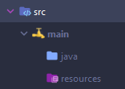

## Explications

Pour faire le bloc nous allons utiliser un spawner qui contiendra un armor stand. Ce porte armure aura sur sa tête votre bloc custom sous forme d'item. Le model de l'item devra avoir une taille supérieur ou égale à la taille du model du spawner.

<p style="color:red">⚠️ À noter que quelque soit la taille de votre model, la hitbox du bloc sera toujours celle du spawner !</p>

## Création du texture pack:

<sup><a href="https://hardel.fr/article/ressourcepack/creation-de-blocs-personnalise-">Pour faire cette page je me suis aidé de l'article d'Hardel sur les blocs personnalisés</a></sup>

Créez un dossier et mettez y dedans 3 fichiers:

- Une image qui va être l'icône de votre pack de texture. Ce fichier devra s'appeler `pack.png`.
- Un dossier `assets` qui contiendra toutes les textures et models de vos blocs personnalisés. Dans ce dossier créez un sous-dossier `minecraft` et un autre sous-dossier ayant le nom de votre plugin.
- Un fichier `pack.mcmeta` qui contiendra les informations à propos de votre texture pack comme la description ou le format.

Dans le fichier `pack.mcmeta` mettez ceci:
```JSON
{
  "pack": {
    "pack_format": 7,
    "description": "Un texture pack pour les blocks custom"
  }
}
```

### Création du CustomModelData

Pour ceux qui ne savent pas ce qu'est un custom model data je vous redirige vers [l'article d'Hardel](https://hardel.fr/article/ressourcepack/apprendre-les-custom-model-data) et la [vidéo de Silvator](https://www.youtube.com/watch?v=7sTQ-1S6KSg).

Dans votre dossier minecraft créez y un répertoire `models` et dans ce dossier faites un sous-dossier nommé `item`.
À l'intérieur de ce dossier créez un ficher `lime_glazed_terracotta.json` et mettez ce code : 
```JSON
{
    "parent": "block/lime_glazed_terracotta",
    "overrides": [
        {"predicate": {"custom_model_data": 1}, "model": "nomDeVotrePlugin:ores/ruby_ore"},
    ]
}
```
Replacez `nomDeVotrePlugin` par le nom de votre plugin.

### Création du model 3D

Dans le dossier de votre plugin créez deux dossiers, `textures` et `models`.

- Le dossier `textures` contiendra les textures de vos blocs.
- Le dossier `models` contiendra des fichiers qui s'occuperont du model 3D de l'item.

## Création du bloc dans le code

Dans votre projet gradle créez un arborescence de fichiers comme celle-ci :



Dans le dossier <code style="color:#5C6BC0">java</code> créez un vos packages et votre classe main. Dans mon cas je vais appeler mes packages `fr.minemobs.customblocktuto` et ma classe Main `CustomBlockTuto`.


Dans le dossier <code style="color:rgb(154, 56, 179)">resources</code> créez un ficher `plugin.yml`.
Dans ce fichier ajoutez les lignes suivantes:
```YAML
name: CustomBlockTuto
main: fr.votre.package.VotreClasseMain
version: 1.0
description: Un tutoriel pour ajouter des blocs personalisés dans Minecraft avec Spigot
api-version: 1.17
author: VotrePseudo
```
Remplacez `CustomBlockTuto` par le nom de votre plugin, `fr.votrepackage.VotreClasseMain` par votre classe Main, `VotrePseudo` par votre pseudo. Et changez la description.

